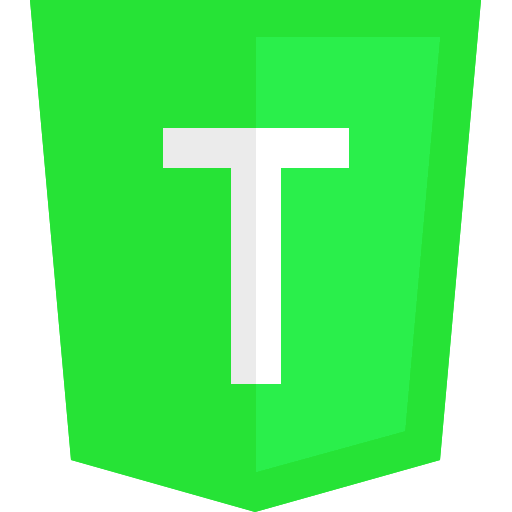

<p align="center">
  
</p>

# Trifle Programming Language (v0.1.2 [Alpha])
## 0.1.2 is an unstable release.
Trifle is a dynamically typed general purpose programming language written entirely in JavaScript.  It (with some hacking) works on both the web and in a Node.js environment.  It derives from Ruby, PHP and JavaScript; here's an example:
```
$name = "John Doe";

println("Hello,", $name);
//=> Hello, John Doe
```

## Features
- (`0.0.1+`) `print` method.
- (`0.0.1+`) Basic array definition method (`array`) & array mutilation methods.
- (`0.0.1+`) Variable definitions. (and referencing)
- (`0.1.0+`) Basic math (unstable!)

Check out the current features and how to use them at the [wiki page](https://github.com/zackenstien/trifle-lang/wiki).

**Math is unstable!  (as of version `0.1.0`)**
```
println(100 * 100); //=> 10000
println((100 / 100) * 100); //=> 1 100
```

## W.I.P. Features
- Accessing a specific index of an array.
- Mathematical expressions.